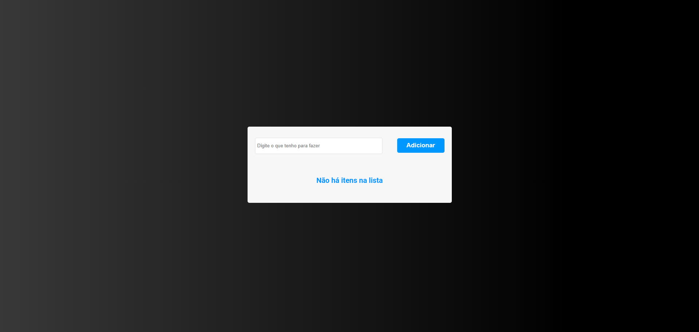
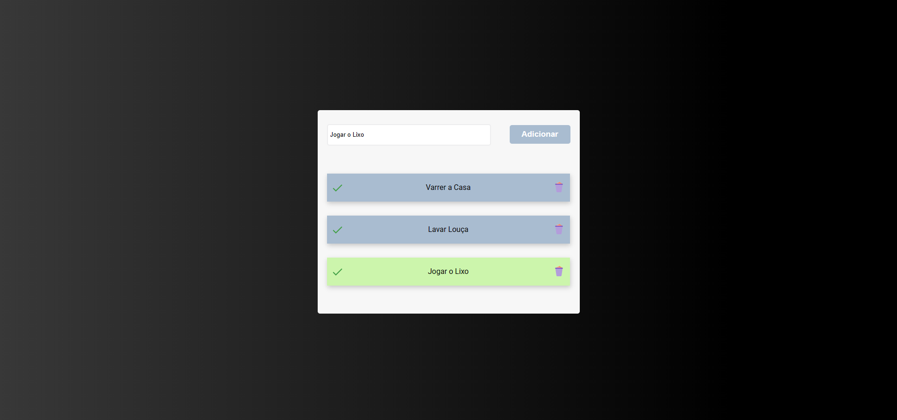
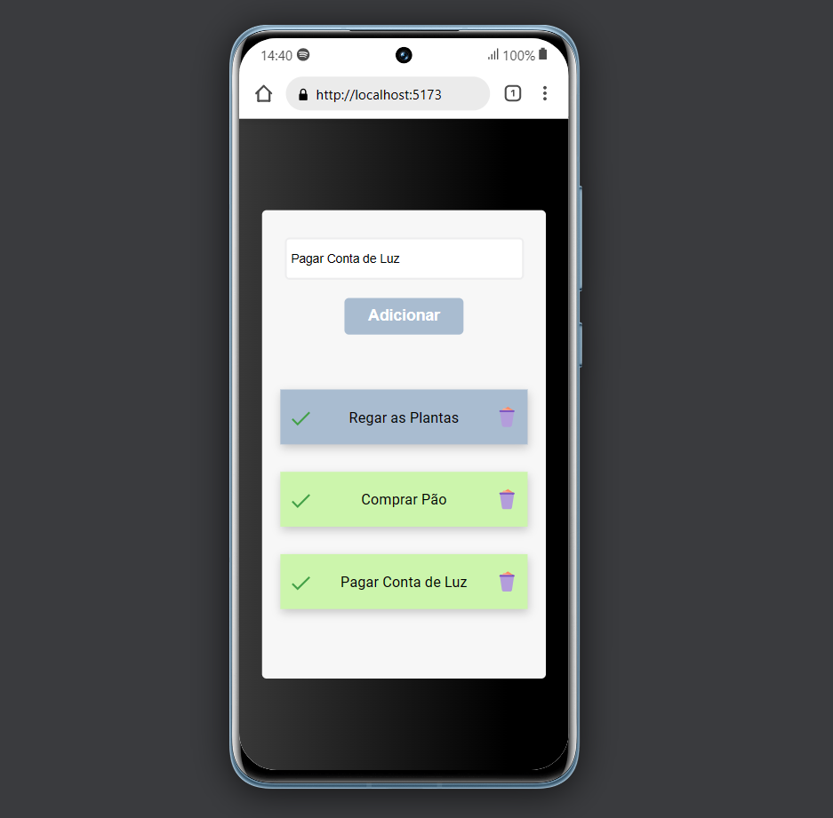

# Lista de Tarefas

> Resultado do Projeto Lista de Tarefas.

### Sobre

O projeto trata-se de um app onde podemos adicionar nossas tarefas, marcar as concluídas e remover tarefas antigas

- [x] Criação do React App
- [x] Criação do Styled-components
- [x] Responsividade

## Ver o Projeto: 

<a 
href="https://todolist-react-2023.vercel.app/" target="_blank">Abrir Projeto✅</a>

## 🤝 Colaboradores

Agradecemos às seguintes pessoas que contribuíram para este projeto:

<table>
  <tr>
    <td align="center">
      <a href="#">
         
        
          <b>Vagner Santos</b>
        
      </a>
    </td>
  </tr>
</table>

